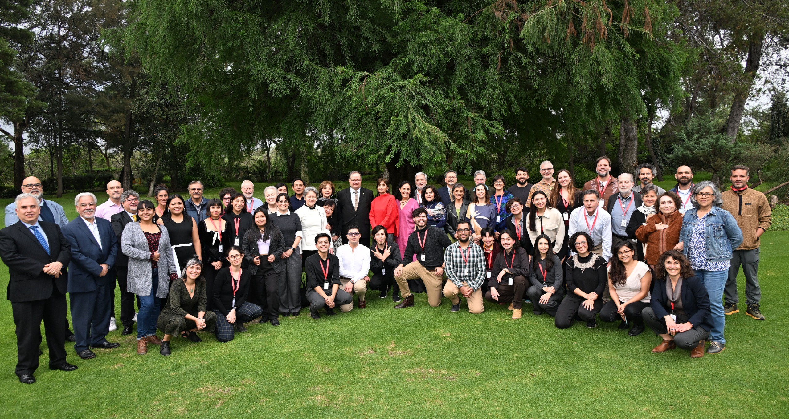

```{r setup}
#| include: false
knitr::opts_chunk$set(echo = FALSE)
```

```{r}
#| include: false
library(htmltools)
source("../R/functions.R")
```

Durante 3 días en Junio de 2025, se reunieron en el Instituto de Biología de la UNAM, representantes de diversos países de América Latina para discutir y relfexionar sobre la historia de la Ecologia en nuestro contiente. Aprovechamos la oportunidad única para poner en marcha un sueño antigo, crear un colectivo que uniese a todos los ecólogos de la región para que compariéramos desafios y retos para una ecología soberana y hecha desde el y para el Sur.

Después de un año de actividades, ya hay mucho que celebrar pero ay aún más por hacer.

**Súmate!**


### Nuestras tareas son:  

- Comunicación entre Sociedades de Ecología
- Divulgación de eventos
- Creación y consolidación de estatutos





<!-- # Quienes somos -->

<!-- *Haga click en las fotos* -->
<!-- ```{r} -->
<!-- #| echo: false -->
<!-- tags$div(class = "row",# Create a row for 3 team-member cards -->

<!-- create_team_card( -->
<!--   person_page = "abeco/index.html", -->
<!--   img_src = "../images/logos/abeco1.png", -->
<!--   name = "ABECO", -->
<!--   text = "Brasil" -->
<!-- ), -->
<!-- create_team_card( -->
<!--   person_page = "maria_noel/index.html", -->
<!--   img_src = "../images/people/maria.png", -->
<!--   name = "María Noel Clerici Hirschfeld", -->
<!--   text = "Uruguay" -->
<!-- ), -->
<!-- create_team_card( -->
<!--   person_page = "lucas/index.html", -->
<!--   img_src = "../images/people/lucas.jpg", -->
<!--   name = "Lucas Enrico", -->
<!--   text = "Argentina" -->
<!-- ), -->
<!-- create_team_card( -->
<!--   person_page = "felipe/index.html", -->
<!--   img_src = "../images/people/felipe.jpg", -->
<!--   name = "Felipe Melo", -->
<!--   text = "Brasil" -->
<!-- ) -->
<!-- ) -->
<!-- tags$div(class = "row", # Create a row for 3 team-member cards -->

<!-- create_team_card( -->
<!--   person_page = "laura/index.html", -->
<!--   img_src = "../images/people/laura.png", -->
<!--   name = "Laura Yahdjian", -->
<!--   text = "Argentina" -->
<!-- ), -->
<!-- create_team_card( -->
<!--   person_page = "alejandro/index.html", -->
<!--   img_src = "../images/people/alejandro.png", -->
<!--   name = "Alejandro Baseiro", -->
<!--   text = "Uruguay" -->
<!-- ), -->
<!-- create_team_card( -->
<!--   person_page = "nico/index.html", -->
<!--   img_src = "../images/people/nico.png", -->
<!--   name = "Nicolás Urbina", -->
<!--   text = "Colombia" -->
<!-- ), -->
<!-- ) -->
<!-- tags$div(class = "row", # Create a row for 3 team-member cards -->

<!-- create_team_card( -->
<!--   person_page = "wesley/index.html", -->
<!--   img_src = "../images/people/wesley.png", -->
<!--   name = "Wesley Dáttilo", -->
<!--   text = "México" -->
<!-- ), -->
<!-- create_team_card( -->
<!--   person_page = "jorge/index.html", -->
<!--   img_src = "../images/people/jorge.png", -->
<!--   name = "Jorge Deyvis", -->
<!--   text = "Cuba" -->
<!-- ), -->
<!-- create_team_card( -->
<!--   person_page = "leonel/index.html", -->
<!--   img_src = "../images/people/leonel.png", -->
<!--   name = "Leonel Sierralta", -->
<!--   text = "Chile" -->
<!-- ) -->
<!-- ) -->
<!-- tags$div(class = "row", # Create a row for 3 team-member cards -->

<!-- create_team_card( -->
<!--   person_page = "luisa/index.html", -->
<!--   img_src = "../images/people/luisa.png", -->
<!--   name = "Luísa Maria Diele Viegas", -->
<!--   text = "Brasil" -->
<!-- ), -->
<!-- create_team_card( -->
<!--   person_page = "thomas/index.html", -->
<!--   img_src = "../images/people/thomas.png", -->
<!--   name = "Thomas Lewinsohn", -->
<!--   text = "Brasil" -->
<!-- ), -->
<!-- create_team_card( -->
<!--   person_page = "arturo/index.html", -->
<!--   img_src = "../images/people/arturo.png", -->
<!--   name = "Arturo Flores-Martínez", -->
<!--   text = "México" -->
<!-- ) -->
<!-- ) -->


<!-- ``` -->

